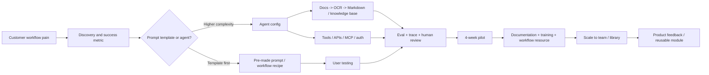
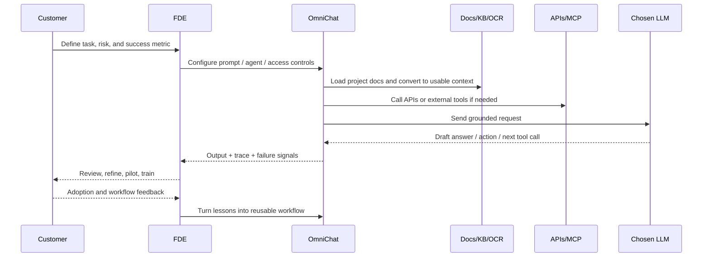

# Baseline Context for an Arka Forward Deployed Engineer Informational Interview

## Executive summary

Arka Works is a London-based consultancy focused on applying AI in the built environment and adjacent professional-services settings. Its public positioning is not “generic AI agency” but “project partner for the AI era” for architects, real-estate developers, and AEC/software start-ups. Public materials show two closely linked offers: **Arka Works** as the consultancy/training layer, and **OmniChat.uk / Omni Accelerator** as the product and enablement layer. Legally, ARKA WORKS LTD was incorporated in September 2023 and OMNICHAT.UK LTD in October 2024; LinkedIn lists Arka Works as a privately held business with 2–10 employees. citeturn31search1turn16view1turn12search1turn12search0turn29view3

The clearest public product thesis is this: **secure, private, repeatable AI workflows for professional teams with sensitive documents and real accountability**. OmniChat publicly advertises browser-based access to OpenAI, Anthropic, Google, and Perplexity models; EU hosting on 80%+ carbon-free energy; Microsoft 365 SSO; token-based pricing; centralised prompt and agent libraries; AI policy acceptance logging; large-context workflows; and direct implementation support. Public posts add further signals: agent builder, project agents, prompt engines, OCR-to-Markdown ingestion via Mistral OCR, external APIs, and support for very large context windows. citeturn8view0turn22search1turn29view0turn29view1turn29view2turn30search0turn30search1

No public Arka job description for a **graduate Forward Deployed Engineer** was located in the reviewed sources, so the role-specific parts of this report are **informed inference**, not confirmed job-spec fact. The strongest inference is that an Arka FDE would sit at the junction of **customer discovery, workflow design, agent configuration, document/context engineering, light integrations, evaluation, rollout support, and product feedback**. That inference is strongly supported by Arka’s own workshops and product posts, and by how major AI companies define FDEs as embedded builders who convert prototypes into production systems, wire the “connective tissue” to customer infrastructure, build evaluation/observability, and feed field learning back into product teams. citeturn7view0turn29view0turn30search2turn17view0turn21view0turn21view1turn18view2

For preparation, the best use of a two-hour informational chat is not rote LeetCode-style revision. Better move: get fluent in **Arka’s actual worldview**. That means understanding the difference between prompt templates and agents; why Arka often prefers full-document context and Markdown conversion over naive attachment handling; when RAG helps and when it does not; how security, policy, and “human in the loop” matter in high-duty-of-care environments; and how an FDE role becomes part engineer, part implementer, part teacher, and part product scout. Public evidence points to **4-week pilot cycles for first implementations**, then **many months of cross-department iteration and scaling**, so any idea like “one agent per month” should be treated as a hypothesis, not a confirmed Arka operating target. citeturn7view0turn29view4turn40search2turn18view2

## Arka in context

Arka Works publicly describes itself as a consultancy specialising in the built environment, helping architects, real-estate developers, and software start-ups adapt and thrive in a changing industry. Keir Regan-Alexander is repeatedly described in public sources as operating “with one foot in practice and one in live software development”, and Arka’s mission is framed as preparing the profession for AI-driven change. That is important interview context: Arka is selling **applied AI transformation inside a domain** rather than pure horizontal infrastructure. citeturn31search1turn16view1turn31search2turn26search4

Public product messaging shows a stack of offers rather than a single SKU. **OmniChat.uk** is the private multi-model application layer. **Omni Accelerator** is the 12-month learning, workflow, and adoption layer. The consultancy side adds workshops on strategy, governance, and practice change. This suggests Arka’s real offering is a combination of **software + implementation + change management + domain fluency**. citeturn8view0turn7view0turn22search1turn39search3

### Public company and product picture

| Area | High-confidence public facts | Why it matters for the interview |
|---|---|---|
| Positioning | Arka Works says it is a built-environment consultancy and “Your Project Partner for the AI Era”; LinkedIn says it works with architects, real-estate developers, and AEC start-ups. citeturn31search1turn29view3 | Expect domain-heavy questions, not just generic AI engineering talk. |
| Legal footprint | ARKA WORKS LTD incorporated 21 September 2023; OMNICHAT.UK LTD incorporated 28 October 2024; both registered at 124 City Road, London. citeturn12search1turn12search0turn12search2turn12search3 | Confirms an early-stage company/product pairing rather than a long-mature platform org. |
| Team scale | LinkedIn lists Arka Works as 2–10 employees. citeturn29view3 | Graduate hires in small teams usually need high agency and broad scope. |
| Core product | OmniChat is described as a secure, private, flexible LLM platform for business settings, accessed in-browser. citeturn8view0turn31search7 | A Forward Deployed Engineer is likely close to live product use, not far from customers. |
| Model access | OmniChat publicly offers access to OpenAI, Anthropic, Google, and Perplexity through one interface. citeturn8view0turn31search7 | You should be able to discuss model trade-offs, routing, and vendor-agnostic design. |
| Enablement layer | Omni Accelerator is a 12-month AI enablement programme with ready-made workflows, 15+ hours of lessons, competency tracking, office hours, and round tables. citeturn8view0turn22search1turn39search3 | Arka clearly cares about rollout, training, and behaviour change, not just shipping features. |
| Adoption signals | Public posts say OmniChat has been deployed to practices across the UK, Europe, and USA; Arka says it works with 60 businesses; one post mentions onboarding a 350+ user practice; another mentions 75 workflow/resources posted for members. citeturn8view0turn29view3turn30search5turn29view4turn29view1 | Suggests meaningful real-world usage and a need for repeatable deployment patterns. |

### Public tech stack and architecture signals

| Layer | What is public | Evidence-backed interpretation | Confidence |
|---|---|---|---|
| Foundation models | OpenAI, Anthropic, Google, Perplexity all appear as supported providers. citeturn8view0turn31search7 | OmniChat is explicitly multi-model rather than tied to one vendor. | High |
| Front-end access | Product is “accessed on your browser”; customers can get their own private URL, e.g. `omnichat.[yourdomain.com]`. citeturn8view0 | Browser-first enterprise app with customer-specific instances/domains. | High |
| Identity and access | Microsoft 365 SSO is explicitly public; access can also be via organisation email; a January 2025 article referenced Microsoft 365 or Google SSO for launch positioning. citeturn8view0turn22search2 | Enterprise identity and admin/group control matter. | High |
| Context strategy | Arka training emphasises large context, full-document processing, Markdown conversion, and often prefers full context over RAG for complex technical/legal workflows. Public posts describe “unabridged prompting” and recommend avoiding RAG except for precise one-off questions. citeturn7view0turn29view0turn30search7turn30search4 | A likely interview theme is **context engineering**, not just “vector DB by default”. | High |
| OCR / ingestion | Public posts say files are sent to **Mistral OCR** before agents see them; Mistral’s own docs say its OCR API extracts ordered text/images from PDFs and images. citeturn29view0turn30search0turn36search0turn36search1 | Arka appears to care about document fidelity, tables, and downstream reasoning quality. | High |
| Agent layer | Public posts mention agent builder, project agents, prompt engines, autonomous steps, agent chains, and external APIs. citeturn29view0turn29view1 | Role likely includes configuring and refining agents, not just prompting by hand. | High |
| External integrations | Public materials mention external APIs, tool access, and agent libraries; comparable FDE job specs at Google emphasise APIs, legacy silos, networking, and MCP servers. citeturn29view0turn21view0turn21view1 | Expect conversations about connectors, tool calling, context sources, and customer systems. | Medium-high |
| Security / privacy | OmniChat says data is not used to train external models; terms say inputs/outputs are not stored beyond what is necessary to provide the service; data is encrypted in transit to providers; business users have a DPA. citeturn8view0turn9view0 | Enterprise/privacy posture is part of the product value proposition. | High |
| Sustainability / reporting | OmniChat advertises EU servers running on 80%+ carbon-free energy and organisational AI usage tracking for annual/quarterly reporting and Scope 3 emissions. citeturn8view0turn22search1 | Customer conversations may include reporting, cost, and environmental accountability. | High |
| Publicly unspecified | No reviewed public source disclosed the core app language, cloud provider, database/vector store, queueing layer, CI/CD, container/runtime setup, or observability stack implementation. | Do not overclaim these in conversation; ask instead. | High |

Public customer practice evidence also matters. Arka’s material consistently emphasises **real-world pilot workflows**, **working groups**, **AI champions**, **policy guardrails**, and **gradual scaling across departments**. In other words: Arka is not pitching magic; it is pitching disciplined adoption inside messy organisations. citeturn7view0turn24view3turn24view4turn40search2

## Likely shape of the graduate Forward Deployed Engineer role

Because no public Arka FDE job spec was available in the reviewed material, the best rigorous answer is: **the role is probably a hybrid of solutions engineer, applied AI engineer, implementation consultant, and internal product feedback loop**. That is exactly where Arka’s public materials point. Arka teaches strategy, policy, prompt systems, agent systems, context management, and workflow rollout; OmniChat exposes agent-building and API-facing capabilities; and comparable FDE definitions from OpenAI, Google Cloud, Salesforce, and SVPG all stress embedding with customers, shipping real systems, unblocking deployments, and converting field friction into reusable product improvements. citeturn7view0turn29view0turn17view0turn21view0turn21view1turn18view2turn17view1

At Arka specifically, the customer environment appears to be high-document, high-ambiguity, and high-accountability. Keir’s public writing repeatedly stresses professional duty of care, structured inputs, context quality, policy, and the importance of “human in the loop”. That makes the likely FDE job less about raw model novelty and more about **getting reliable outcomes from live customer material**. citeturn15view0turn23view0turn24view4turn40search1

### Probable responsibilities, deliverables, and cadence

| Probable responsibility | Why it is likely | Tangible deliverable | Most plausible cadence |
|---|---|---|---|
| Workflow discovery and problem framing | Arka’s strategy workshop is built around defining concrete pilot projects with measurable outcomes; FDE archetypes at OpenAI/Google/Salesforce start with discovery and scoping. citeturn7view0turn17view0turn21view1turn18view2 | Workflow map, value hypothesis, risk notes, success metric | Start of each engagement / first week |
| Choosing **prompt template vs agent** | Arka publicly says organisations should usually start with pre-made prompts and move to agents when the process is clearly decomposable into actions. citeturn30search2 | Decision memo or design note: template, project agent, or deeper integration | Early design step |
| Context and document engineering | Arka stresses Markdown conversion, full-document processing, and long-context retrieval; public posts mention Mistral OCR and project knowledge-base agents. citeturn7view0turn29view0turn30search0turn36search0 | OCR/Markdown ingestion flow, knowledge-base prep, context strategy | Front-loaded, then iterated |
| Agent and workflow configuration | Public posts describe agent builder, project agents, prompt engines, external APIs, autonomous steps, and agent chains. citeturn29view0turn29view1 | Working agent, shared prompt/agent config, test prompts, tool definitions | Within pilot window |
| Integration work | Google’s current FDE descriptions explicitly call this the “connective tissue” between AI products and customer APIs, silos, and security perimeters; Arka public posts reference tools and APIs directly. citeturn21view0turn21view1turn29view0 | API connector, tool schema, MCP/tool surface, auth flow, data mapping | As blockers appear |
| Evaluation and observability | Google emphasises evaluation pipelines and observability; OpenAI says traces capture model calls, tool calls, handoffs, and guardrails; Arka sells repeatable professional workflows rather than one-off demos. citeturn21view0turn21view1turn42view0turn42view1turn35search0 | Eval dataset, trace review, failure taxonomy, rollout recommendation | Every serious deployment |
| Training and adoption support | Omni Accelerator includes on-demand learning, workflow resources, office hours, and “workflow surgeries”; Arka’s public rollout stories stress many months of cross-team iteration. citeturn8view0turn28search8turn29view4turn40search2 | User guide, internal demo, training session, FAQ, office-hours notes | Weekly / ongoing during rollout |
| Product feedback and reuse | OpenAI/Google/Salesforce all frame FDEs as a two-way street back into product; Arka publicly publishes reusable workflow resources and prompt engines. citeturn17view0turn18view3turn21view0turn29view1 | Reusable module, pattern library entry, product request, internal playbook | After each pilot or issue cluster |

The most important cadence inference is this: **Arka’s public materials do not suggest a factory target like “one agent per month.”** They suggest a staged pattern instead: define a measurable pilot for a **first 4-week implementation cycle**, then keep iterating for **many months** across departments, with training, show-and-tells, surgery support, and gradual scaling. Salesforce’s public FDE model for agents is similarly measured in **about three months for one or two use cases**, not in arbitrary monthly feature quotas. citeturn7view0turn29view4turn40search2turn18view2

So if your connection asks “what does success look like?”, a strong answer is probably: **ship one scoped, high-value workflow into reliable use, then codify it so it can be reused and scaled**. That fits Arka’s public operating model much better than “build lots of flashy agents quickly.” citeturn24view3turn23view0turn39search1

### Likely agent lifecycle at Arka

Arka’s public workflow philosophy appears to move from domain problem discovery into structured prompt/agent design, then into context engineering, evaluation, training, and reuse. Comparable FDE job specs add deployment, observability, and product feedback as core loops. citeturn7view0turn29view0turn17view0turn21view1turn42view1



### Likely deployment flow

Public Arka materials consistently tie product use to policy, private instances, documentation, and shared workflow libraries; current FDE role definitions from Google/OpenAI add evaluation, traces, and customer engineering collaboration. citeturn8view0turn29view0turn21view0turn42view0



## Interview signals and preparation

A graduate Arka FDE conversation is likely to test whether the candidate can reason across **three layers at once**: the technical layer, the workflow/business layer, and the rollout/change layer. Arka’s own material is full of this triad: technical setup, practical workflow value, and organisational guardrails. Comparable FDE roles at OpenAI, Google, and Salesforce do the same. citeturn7view0turn24view3turn17view0turn21view0turn18view1

### Likely interview topics and best prep moves

| Topic | Why it is likely at Arka | What a strong answer usually shows | Best prep action |
|---|---|---|---|
| Workflow decomposition | Arka repeatedly says to start with real workflows, not hypothetical research. citeturn24view3turn23view0 | Ability to break vague business pain into steps, inputs, outputs, risks, and success metrics | Prepare two examples of messy workflows you could structure |
| Prompt template vs agent | Arka publicly distinguishes reusable prompt recipes from more complex agents. citeturn30search2turn29view1 | Judgement about when extra complexity is justified | Practise explaining one task that should stay a template and one that should become an agent |
| Long context vs RAG | This is unusually central to Arka’s public philosophy. citeturn7view0turn29view0turn30search7turn34search13 | Understanding of trade-offs between completeness, retrieval precision, latency, and cost | Be ready to explain when you would prefer full context, when RAG helps, and why |
| OCR and document fidelity | Arka explicitly uses OCR-to-Markdown for better reading of tables and complex PDFs. citeturn29view0turn30search0turn36search0 | Care about input quality, not just output cleverness | Review how OCR, Markdown conversion, and chunking affect answer quality |
| Tool use and integrations | Public posts mention external APIs; modern FDE specs emphasise tools, APIs, MCP, and customer systems. citeturn29view0turn21view0turn42view2turn33search0 | Comfort with “connective tissue” work between model and real systems | Review function calling, APIs, and MCP at a conceptual level |
| Evaluation and observability | Google and OpenAI both explicitly foreground evals and traces. citeturn21view0turn42view0turn42view1turn35search0 | Reliability mindset: how you know the system is working | Prepare a simple eval plan: success criteria, failure cases, monitoring signals |
| Security, privacy, and policy | OmniChat’s public value proposition is privacy/security; Arka sells guardrails workshops. citeturn8view0turn9view0turn40search0turn40search1 | You think about access control, data leakage, responsible use, and professional accountability | Prepare a short answer on what you would never upload to a consumer tool |
| Human in the loop | Arka’s writing stresses that high-value professional work still requires judgement and responsibility. citeturn23view0turn15view0 | Mature view of augmentation rather than replacement | Have one example of when human review must stay mandatory |
| Customer communication | FDE roles are explicitly customer-facing at OpenAI and Salesforce. citeturn17view0turn18view1 | You can explain technical trade-offs in plain language | Practise describing RAG, SSO, and evals to a non-engineer |
| Change management | Omni Accelerator, AI working groups, workflow surgeries, and policy handbooks all signal rollout work. citeturn8view0turn28search8turn29view4turn40search1 | You understand adoption friction, training, and pilot sequencing | Prepare one story about helping others adopt a new tool/process |
| Product judgement | FDEs at OpenAI/Google/Salesforce are a feedback loop into product. citeturn17view0turn18view3turn21view1 | Ability to spot repeatable pain vs one-off custom work | Think of a time you turned a one-off fix into a reusable pattern |
| Learning mindset | Salesforce explicitly lists a learning mindset; Arka writes constantly about experimentation without hype. citeturn18view1turn23view0 | Comfort with ambiguity and fast iteration | Prepare an example of learning a tool quickly under pressure |

### Prioritised prep checklist

| Priority | What to prepare | Why it matters most | Suggested effort |
|---|---|---|---|
| Must-do | Read Arka home, OmniChat, and training pages and write down 10 factual anchors | Prevents generic answers; gives you Arka’s own language | 30–40 mins |
| Must-do | Build one end-to-end deployment story in your own words | Lets you answer “what would you do first with a customer?” | 20 mins |
| Must-do | Learn the distinctions between prompt templates, agents, long context, RAG, OCR, and evals | These are the most likely technical conversation pivots | 30 mins |
| Must-do | Prepare two behavioural stories: one about ambiguity, one about teaching/supporting others | Small-team FDE roles reward agency and communication | 20 mins |
| High-value | Prepare a mini case study using a document-heavy workflow | Fits Arka’s core public use cases | 15 mins |
| High-value | Practise a privacy/guardrails answer | Arka is visibly serious about responsible deployment | 10 mins |
| High-value | Prepare three questions about product feedback loops and deployment cadence | Shows genuine understanding of FDE work | 10 mins |
| Nice-to-have | Refresh concepts around tool calling, APIs, and MCP | Useful if the chat goes deeper into integrations | 15 mins |
| Nice-to-have | Review OpenTelemetry-style traces/metrics/logs vocabulary | Useful for observability discussion | 10 mins |

If the chat really runs for two hours, the best use of that time is probably: **role reality first**, **customer/use-case examples second**, **technical patterns third**, **career path and team shape last**. That ordering aligns with how Arka publicly talks about work: start from real practice problems, not from abstract stack diagrams. citeturn24view3turn39search1

## Shared vocabulary

The table below is designed to function as shared grounding for you and any future local agent. Definitions are concise, operational, and tuned to Arka’s public language rather than generic textbook phrasing.

### Arka and customer-practice vocabulary

| Term | Concise definition | Arka-relevant example | Source |
|---|---|---|---|
| **Arka Works** | A London consultancy focused on AI in the built environment and professional practice. | Helping architects and developers adapt workflows and policy for AI use. | citeturn31search1turn16view1 |
| **OmniChat.uk** | Arka’s private, browser-based, multi-model LLM platform for business use. | One interface for OpenAI, Claude, Gemini, and Perplexity. | citeturn8view0turn31search7 |
| **Omni Accelerator** | The enablement and learning layer around OmniChat. | Structured lessons, workflow resources, office hours, and round tables for member practices. | citeturn8view0turn22search1turn39search3 |
| **AI front door** | A default organisational entry point to AI, configured with the right models, prompts, and knowledge. | An OmniChat helper with bespoke instructions and a knowledge base for the whole team. | citeturn8view0 |
| **Practice** | Arka’s public term for a customer organisation, often an architecture or professional-services firm. | “Practice members” of Omni Accelerator. | citeturn7view0turn8view0 |
| **AI working group** | A cross-functional internal team that leads testing, governance, and adoption. | Arka describes working groups as broadly representative across practice teams and skills. | citeturn24view3turn29view4 |
| **AI champions programme** | Named internal owners who help drive adoption and accountability. | Arka’s strategy workshop lists an AI Champions programme as a learning outcome. | citeturn7view0 |
| **Permission structures** | Clear organisational signals about what AI use is encouraged, restricted, or prohibited. | Policy that “signals permission” so staff know how to use AI responsibly. | citeturn40search1 |
| **Guardrails** | Governance boundaries for responsible and reliable AI use. | Arka’s public policy workshop uses a “10 Guardrails” framework. | citeturn40search0turn40search1 |
| **4-week implementation cycle** | Arka’s publicly stated first pilot horizon for measurable AI outcomes. | A first workflow pilot with defined ownership, outcomes, and review points. | citeturn7view0turn40search0 |
| **Workflow resource** | A documented how-to asset that members can pick up and use. | One of the 75 workflow/resources posted to members, with instant update emails. | citeturn29view1turn39search0 |
| **Workflow surgery** | Hands-on support for fixing or improving near-working prototypes. | Members bring prototypes and Arka helps get them “up and running nicely”. | citeturn28search8 |
| **Pre-made prompt** | A reusable prompt template with variable inputs, similar to a recipe. | Teams share a standardised prompt for a recurring business task. | citeturn8view0turn30search2 |
| **Prompt engine** | An agent that rewrites a human brief into model-specific prompt instructions. | An OmniChat agent that turns an image+text brief into a structured Nano Banana or Midjourney prompt. | citeturn29view1 |

### Agent, deployment, and observability vocabulary

| Term | Concise definition | Arka-relevant example | Source |
|---|---|---|---|
| **Project agent** | A retrieval-focused agent attached to project documentation or a project knowledge base. | An OmniChat “Project Agent” that answers questions over project files. | citeturn29view0 |
| **Custom agent** | An AI system configured for a specific task, domain, or workflow rather than general chat. | A Building Safety Act bot or a product-spec researcher agent. | citeturn32view0turn28search1 |
| **Agent chain** | A workflow where one agent or model step hands work to another. | Public Omnichat posts mention autonomous steps and “Agent Chains”. | citeturn29view0 |
| **Mixture-of-Agents** | Using multiple agents/models in combination for better orchestration or quality. | Arka explicitly mentions “Mixture-of-Agents” in public product posts. | citeturn29view0 |
| **Long context window** | The amount of input a model can reason over in one run. | OmniChat public posts say some supported models now handle roughly 1 million tokens, about 3,000 pages of text. | citeturn29view2turn30search8 |
| **Unabridged prompting** | Arka’s term for giving models large, plain-text or Markdown context instead of relying on poor attachment handling. | Feeding 90k words of prepared text before asking for an answer. | citeturn30search7 |
| **OCR** | Optical character recognition: converting document images/PDFs into machine-readable text/structure. | Arka uses Mistral OCR before the agent sees project files. | citeturn30search0turn29view0turn36search0 |
| **Markdown conversion** | Turning documents into structured plain text that models read more reliably. | Arka says OCR-to-Markdown improves handling of tables and complex docs. | citeturn29view0turn30search0 |
| **RAG** | Retrieval-Augmented Generation: grounding an LLM with retrieved external knowledge. | Arka publicly says it often prefers full-context methods over RAG for technical and legal workflows, while still allowing RAG where useful. | citeturn34search13turn34search17turn29view0turn7view0 |
| **Knowledge base** | The corpus of files and references an agent can search over. | A project knowledge base behind a Project Agent. | citeturn29view0 |
| **Tool calling** | Letting a model request access to external functions or capabilities. | Calling a search tool, database tool, or internal action from an agent workflow. | citeturn42view2 |
| **API integration** | Connecting the agent/application to another software system programmatically. | A product-spec workflow that uses the Perplexity Pro API. | citeturn28search1turn42view2 |
| **MCP** | Model Context Protocol, an open standard for connecting AI applications to external systems. | Giving an agent structured access to tools, databases, or workflows. | citeturn33search0turn35search17 |
| **MCP server** | A server that exposes tools or data to an AI application through MCP. | Google’s FDE role descriptions explicitly mention production-grade workflows using MCP servers. | citeturn33search4turn21view0turn21view1 |
| **Observability** | Understanding internal system state through outputs such as traces, metrics, and logs. | Monitoring whether an agent is choosing tools correctly and meeting latency/accuracy goals. | citeturn33search11turn33search3 |
| **Telemetry** | The emitted operational data from a system. | Trace, metric, and log data from an agent run. | citeturn33search3turn33search19 |
| **Trace** | An end-to-end record of one workflow run. | OpenAI says traces can capture model calls, tool calls, handoffs, guardrails, and custom spans. | citeturn42view0turn42view1 |
| **Eval** | A formal test of whether model or agent outputs meet defined criteria. | Scoring whether an agent picked the right tool or followed policy. | citeturn35search0turn42view1 |
| **Handoff** | Passing work from one agent/workflow step to another. | OpenAI includes handoffs directly in traces and evaluation workflows. | citeturn42view0turn42view1 |
| **Guardrail** | A runtime or policy constraint to keep behaviour within acceptable bounds. | Safety policy, allowed tools, or human review before a sensitive action. | citeturn42view0turn40search0 |
| **SSO** | Single sign-on: using an organisation’s identity provider for access control. | OmniChat supports Microsoft 365 SSO and group-controlled access. | citeturn8view0 |
| **Human in the loop** | Keeping human judgement and review in the workflow. | Arka argues high-value professional work cannot responsibly run without oversight. | citeturn23view0turn15view0 |
| **Reasoning loop / tool selection** | The internal pattern by which an agent decides what step or tool to use next. | Google’s FDE role explicitly mentions observability around reasoning loops, tool selection, and latency. | citeturn21view1 |
| **Scope 3 AI reporting** | Reporting indirect emissions associated with AI use. | OmniChat advertises usage tracking to support quarterly/annual Scope 3 reporting. | citeturn8view0turn22search1 |

## CONTEXT.md template and quick reference

The template below is designed for **local reuse by future agents**. Its job is simple: keep confirmed facts separate from inference, preserve evidence, and make the next conversation more useful than the last. The example values reflect public evidence reviewed here, especially Arka’s positioning, OmniChat/Omni Accelerator product facts, and the inferred FDE role shape. citeturn31search1turn8view0turn7view0turn29view0turn29view4

```markdown
---
project: "Arka informational interview baseline"
created_at: "2026-06-07"
language: "en-GB"
owner: "<your_name>"
role_focus: "Graduate Forward Deployed Engineer"
organisation: "Arka Works / OmniChat.uk"
document_purpose: "Ground future agents and prep for informational interviews"
confidence_labels:
  - confirmed
  - inferred
  - open_question
last_updated_by: "<agent_or_human_name>"
---

# Objective

Prepare for a 2-hour informational interview with a work connection who is interviewing for a graduate Forward Deployed Engineer role at Arka.

# Quick facts

- [confirmed] Arka Works is a London-based consultancy focused on AI in the built environment.
- [confirmed] OmniChat.uk is Arka's secure private multi-model LLM platform for business settings.
- [confirmed] Omni Accelerator is the learning/adoption layer with workflows, lessons, office hours, and competency tracking.
- [confirmed] Public customer categories include architects, real-estate developers, and AEC/software start-ups.
- [inferred] The graduate FDE role likely blends customer discovery, workflow design, agent configuration, integrations, documentation, and rollout support.
- [confirmed] Public material points to a first 4-week implementation cycle for pilots.
- [inferred] Durable customer adoption likely takes months, not days.

# Company snapshot

## Mission and positioning
- [confirmed] "Your Project Partner for the AI Era"
- [confirmed] Arka's mission is to help the profession adapt to AI-driven change
- [confirmed] Strong domain focus: architecture / AEC / professional services

## Products
### OmniChat
- [confirmed] Browser-based
- [confirmed] Supports OpenAI / Anthropic / Google / Perplexity
- [confirmed] Private instances and custom domains
- [confirmed] Microsoft 365 SSO
- [confirmed] Central prompt and agent libraries
- [confirmed] Policy acceptance logging
- [confirmed] EU hosting / usage reporting / Scope 3 support

### Omni Accelerator
- [confirmed] 12-month enablement programme
- [confirmed] 15+ hours of structured lessons
- [confirmed] Workflow/resource library
- [confirmed] Office hours / round table / competency tracking

# Public tech signals

## What is confirmed
- [confirmed] Mistral OCR is used publicly in Arka examples for OCR -> Markdown conversion
- [confirmed] Agent builder and project agents are public OmniChat features
- [confirmed] Prompt engines exist as agents for model-specific prompting
- [confirmed] Arka publicly discusses full-document context, long context windows, and selective use of RAG

## What is not public
- [open_question] Core backend language
- [open_question] Cloud provider and deployment topology
- [open_question] Database / vector store / caching layer
- [open_question] Internal observability stack
- [open_question] CI/CD and runtime isolation model

# Role hypothesis

## Short version
A graduate FDE at Arka likely acts as an embedded builder and implementer for customer AI workflows.

## Likely responsibilities
- [inferred] Map a customer workflow and define one measurable pilot
- [inferred] Decide whether a task should stay a prompt template or become an agent
- [inferred] Prepare context: OCR, Markdown, document organisation, knowledge base
- [inferred] Configure prompts, agents, tools, and possibly APIs/MCP surfaces
- [inferred] Run evals / inspect traces / fix failure modes
- [inferred] Document and train, not just build
- [inferred] Feed repeatable lessons back into product and workflow libraries

## Likely success metrics
- [inferred] Production adoption
- [inferred] Workflow time saved or quality improved
- [inferred] Fewer hallucinations / better grounding
- [inferred] Reliable tool use and acceptable latency
- [inferred] Reusable workflow or module created
- [inferred] Positive customer/team adoption

# Shared vocabulary

- AI front door
- pre-made prompt
- prompt engine
- project agent
- long context window
- unabridged prompting
- OCR
- Markdown conversion
- RAG
- MCP
- trace
- eval
- guardrail
- SSO
- human in the loop

# Questions to ask in the chat

## Role reality
- What does "forward deployed" mean at Arka in day-to-day practice?
- Where is the line between coding, configuration, and customer enablement?
- What would success look like in the first 90 days for a graduate?

## Product and architecture
- How do you decide between prompt templates, project agents, and deeper integrations?
- When do you prefer full-context approaches over RAG?
- Which integrations matter most today: OCR, APIs, SSO, MCP, or something else?

## Customers and delivery
- What customer problems get traction first?
- What makes a pilot successful by week four?
- How do field learnings get turned into reusable product/workflow improvements?

## Team and growth
- What skills are hardest to teach?
- How much travel or customer embedding is typical?
- What background tends to do well: software, architecture, product, or mixed?

# Evidence log

| claim | confidence | source | notes |
|---|---|---|---|
| Arka focuses on built environment AI | confirmed | <source_link> | homepage / mission |
| OmniChat supports four model providers | confirmed | <source_link> | product page |
| 4-week first implementation cycle | confirmed | <source_link> | training page |
| Graduate FDE = hybrid role | inferred | <source_link> | synthesis from Arka + OpenAI/Google/Salesforce FDE docs |

# Notes after conversation

## Confirmed by human source
- ...

## Corrected assumptions
- ...

## New names / tools / workflows mentioned
- ...

## Follow-up actions
- ...
```

### One-page quick-reference cheat sheet

| Topic | Keep in your head |
|---|---|
| What Arka is | **Consultancy + product + enablement**, aimed at built-environment and professional-services workflows. |
| What OmniChat is | Private browser-based multi-model AI workspace with shared prompts/agents, SSO, and usage/policy controls. |
| What makes Arka distinctive | Domain fluency, private enterprise posture, OCR/Markdown/context quality, training, and adoption support. |
| Likely FDE job | Discover workflow pain, choose template vs agent, wire context/tools, evaluate, document, train, and loop feedback into product. |
| Core technical themes | Long context, OCR, Markdown, RAG judgement, tool calling, APIs/MCP, evals, traces, security. |
| Core behavioural themes | High agency, calm in ambiguity, domain empathy, teaching ability, customer translation, pragmatic product thinking. |
| Best talk track | “Start from a real workflow, scope a small pilot, protect privacy, measure outcomes, then codify what works.” |
| Biggest mistake to avoid | Talking like a generic GenAI fan instead of someone who understands reliability, rollout, and accountable professional work. |

### Suggested questions to ask during the chat

| Question | What it reveals |
|---|---|
| What does “forward deployed” mean at Arka in practice: discovery, coding, rollout, or all three? | Actual scope of the role |
| What kinds of customer problems are most likely to get approved as first pilots? | Commercial wedge and product-market fit |
| Where do you draw the line between a reusable prompt template and a true agent? | Product philosophy and engineering threshold |
| How often do customer projects need real integrations versus clever context engineering? | Whether the role is more applied-AI or integration-heavy |
| How do you decide between full-context methods and RAG? | Architecture judgement and Arka’s internal heuristics |
| What does good observability look like for an Arka deployment today? | Engineering maturity around traces/evals |
| What normally breaks first in a customer rollout: data quality, auth, prompting, expectations, or adoption? | Real-world failure modes |
| What does a strong graduate do in the first month that weak candidates do not? | Immediate performance bar |
| How much of the role is building versus training/documenting? | Day-to-day shape and fit |
| How do field lessons get turned into product improvements or new workflow resources? | Feedback loop strength |
| Which customer capabilities matter most for success: technical team, working group, policy, or leadership buy-in? | Delivery dependencies |
| If you were preparing for this role from scratch, what would you learn first? | Highest-leverage prep from an insider |

## Open questions and limitations

This report is strong on **public company/product signals** and on **FDE role inference**, but a few things remain genuinely unspecified.

- I did **not** find a public Arka careers page or public graduate FDE job description in the reviewed sources, so the role section is a careful synthesis, not a confirmed role spec.
- Public materials do **not** disclose the core internal application stack: backend language, cloud provider, deployment topology, vector store, queueing, or CI/CD.
- A public OmniChat data-processing addendum link exists, but the PDF itself was not accessible in this research session, so deeper processor/subprocessor details are not included here. citeturn9view0
- Adoption figures such as **60 businesses**, **75 workflow/resources**, and **350+ users onboarded at one practice** come from public LinkedIn/company posts, not audited filings. They are useful signals, but should still be treated as company-reported figures. citeturn29view3turn29view1turn29view4turn30search5

The safe operating assumption is: **Arka is early-stage, domain-specific, productising its consulting knowledge, and likely wants FDEs who can turn messy customer workflows into reliable, teachable, reusable AI systems.** That is the clearest pattern across the public evidence. citeturn31search1turn8view0turn7view0turn29view0turn17view0turn21view1